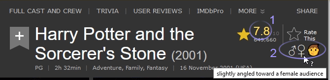

# IMDB Nuanced Rating
This is a browser user script to add more context of a movie or series, on the title page.

The script enhances the IMDB title page in two ways.
1. It recomputes the rating, by nullifying 10 or 1 start review bombing effects.
2. It shows who the main target audience is.

The nullification of review bombing is performed by an algorithm created by Daniel Bond (ChoFlojT). Empirical evidence shows that the computed score is either identical or very close to the rating of old classics, while it has a larger effect of the ratings for newer titles. The rationale behind this is that new titles are subjected to review bombing by bad market actors such as marketing departments or other people with agendas. As a film or series ages, the bad actors tend to go away, and left are an overwhelming amount of real viewer votes. The rating recomputation allows us to see pretty well what the actual score will be years from now. Thus the computed rating should more accurately reflect what the audience actually thinks than the rating which IMDB produces by default.

The second enhancement shows to what degree a movie is aimed at a female/male/child/teen audience.
An icon for children (including tweens/teens) only show up when a title has been identified as having received a noticeably higher rating for a very young audience.
The relative size of the male / female icons visually indicates towards which gender the title is aimed at. Hovering over the icons gives a bit additional nuance.

See screenshow below for a title with all features activated.
Shown is a movie aimed at a younger audience, and watched by a smidgen more girls/mothers than boys/fathers.

